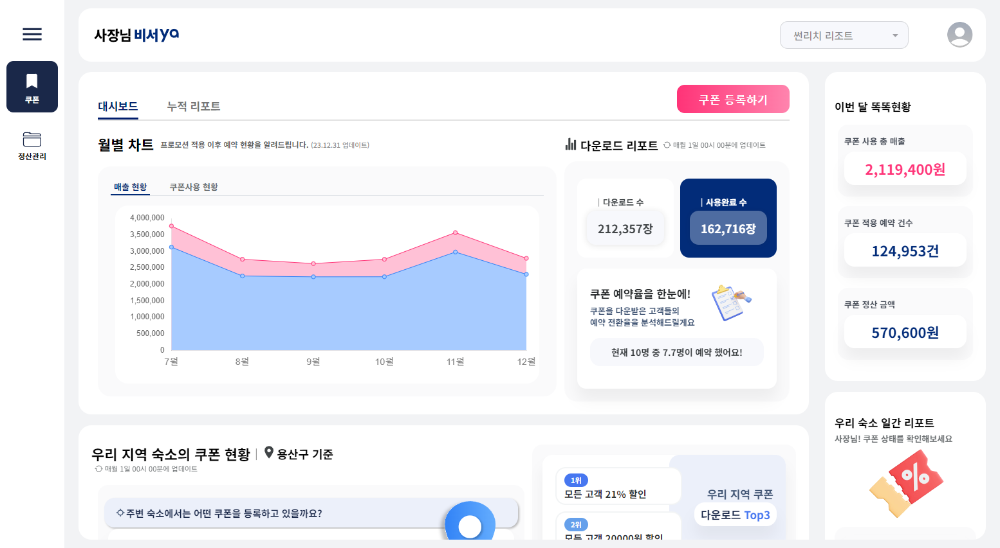
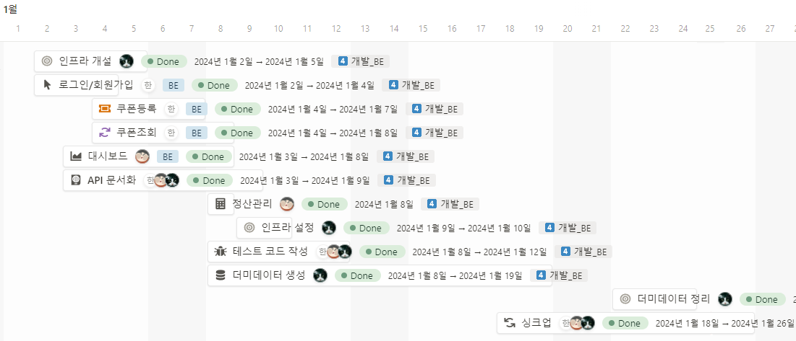
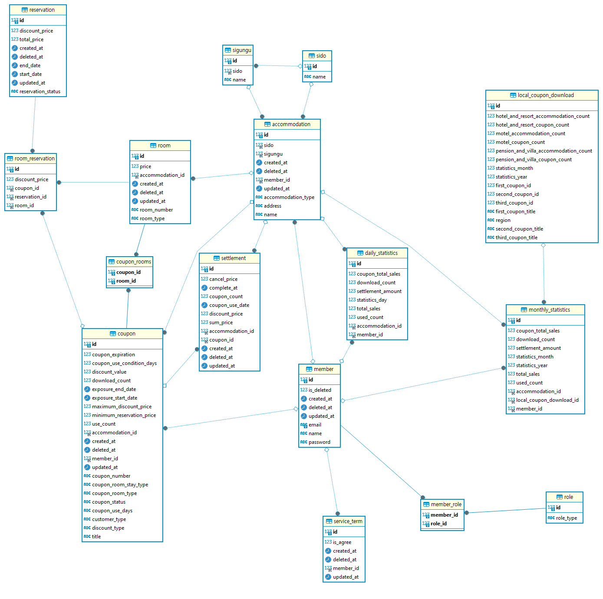
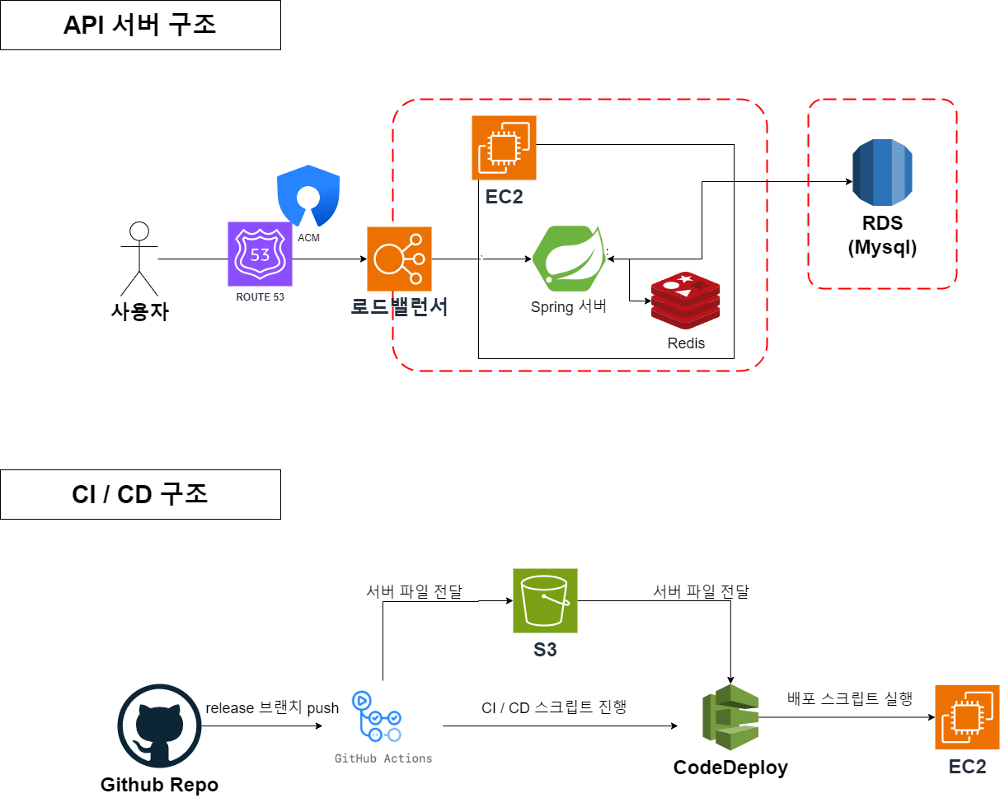

# 사장님 비서ya - B2B Self-coupon Backoffice 서비스

<div align="center">
  <a href="https://github.com/othneildrew/Best-README-Template">
    
  </a>

<h3 align="center">사장님 비서 ya</h3>

  
  
  

  <p>
    <b>쿨피스</b> 팀의 JAVA Spring Boot 기반 REST API 서버 개발용 백엔드 레포지토리입니다. 
    <br />
    <br />
    <a href="https://coolpeace.store/swagger-ui/index.html">배포된 API 서버</a>
    /
    <a href="https://sajangnim-ya.vercel.app/login">데모 웹사이트</a>
  </p>
</div>

## 🧑‍🤝‍🧑 BE 팀 조원

| 프로필                                                                                                                | 이름  | 역할                            |
|--------------------------------------------------------------------------------------------------------------------|-----|-------------------------------|
| <a href="https://github.com/KwonJuHwan"></a> | 권주환 | 팀장, 쿠폰 대시보드, Batch, 정산 관리     |
| <a href="https://github.com/whdgns5059"></a> | 김종훈 | 데이터 관리 & 생성, 숙박, 객실 , 인프라     |
| <a href="https://github.com/tkddn204"></a>     | 한상우 | 시큐리티(로그인,회원가입), 쿠폰 CRUD , 인프라 |

## 📝 프로젝트 요약



야놀자에 등록된 *숙박업소 사장님들*이 이용할 수 있는 **셀프 쿠폰 발급 서비스**입니다.

이용자(숙박업소 사장님)는 쿠폰을 조회,발급,수정,삭제,상태변경을 할 수 있으며, 사용된 쿠폰의 정산 내역도 확인할 수 있습니다.
또한, 대시보드(메인)화면에서 사용자는 다양한 쿠폰에 대한 정보들을 확인해볼 수 있습니다.

## ⭐️ 핵심 기능

### 회원

- 숙박업소 사장님들은 야놀자에 등록된 계정으로 회원가입을 할 수 있습니다.
- 로그인 시간에 만료 시간을 두어 일정 시간이 지나면 서비스 사용을 위해 재로그인을 해야 합니다.
- 아이디와,비밀번호를 통하여 인증을 진행하며 일치하지 않을 경우 서비스 사용을 할 수 없습니다.

### 쿠폰

- 사용자는 쿠폰을 다양한 상태 값으로 발급할 수 있습니다.
- 사용자가 발급한 쿠폰들을 조회할 수 있습니다.
- 쿠폰 조회 화면에서 쿠폰 수정 및 삭제를 할 수 있습니다.

### 정산

- 사용자는 지난달 사용된 쿠폰의 정산금액, 이번달 정산 예정 금액을 조회할 수 있습니다.
- 날짜를 입력하여, 원하는 날짜의 과거 정산내역을 조회할 수 있습니다.

### 대시보드

- 쿠폰,예약,정산에 대한 일별 통계 데이터, 월별 통계 데이터, 연도별 통계 데이터, 누적 데이터와 같은 데이터들을 확인할 수 있습니다.
- 같은 지역구, 다른 숙소들의 다운로드가 많은 쿠폰, 평균 쿠폰 사용량과 같은 정보들을 확인할 수 있습니다.

## 🚀 프로젝트 일정

> **프로젝트 기간** : 2024년 1월 2일 ~ 2024년 1월 29일



## 🛠️ 개발 환경

- 자바 버전 : **17**
- 스프링 버전 : **Spring Boot 3**
- 데이터베이스 : Mysql, Redis (+ docker-compose)
- 문서화 도구 : RestDocs + Swagger UI
- 주요 의존성 (자세한 내용은 [build.gradle](./build.gradle)을 참고해주세요!)
    - Validation
    - Security
    - Batch
    - Data-JPA
    - Data-Redis
    - QueryDSL

## ✨실행환경 설정 방법

아래 실행환경 설정은 **Java 17 버전**과 **docker**가 개인 개발 환경에서 설치되어 있다는 가정 하에 작성되었습니다.

1. **`.env` 파일을 만들어야 합니다.**

env 파일은 다음 [env 예제 파일(`.env.example`)](/.env.example)의 형식을 참고해주세요.

```properties
# MYSQL 설정
# !주의: USERNAME에 root를 입력하시면 안됩니다. root 외의 다른 이름을 입력해주세요.
MYSQL_USER=<개인 개발 환경의 MYSQL DB username>
MYSQL_PASSWORD=<개인 개발 환경의 MYSQL DB password>
MYSQL_VOLUME_PATH=./bin/mysql # MySQL 데이터를 저장할 개인 개발 환경의 경로
MYSQL_URL=localhost # 개인 개발 환경에서 사용할 MySQL URL
MYSQL_PORT=3306 # 개인 개발 환경에서 사용할 MySQL PORT
# JWT 설정
JWT_SECRET_KEY=<your-jwt-secret-key> # BASE64로 인코딩된 JWT 시크릿 키
JWT_ACCESS_EXPIRATION=36000000 # 액세스 토큰의 만료시간 (기본 1시간)
JWT_REFRESH_EXPIRATION=864000000 # 리프레시 토큰의 만료시간 (기본 24시간)
# Redis 설정
LOCAL_REDIS_VOLUME_PATH=./bin/redis # REDIS 데이터를 저장할 개인 개발 환경의 경로
LOCAL_REDIS_PORT=6379 # 개인 개발 환경에서 사용할 REDIS PORT
```

2. `docker compose`를 사용하여 mysql과 redis 데이터베이스 환경을 만들어야 합니다.

인텔리제이의 docker plugin 기능을 사용하시거나, 다음 명령어를 입력해서 데이터베이스 환경을 구성하세요.

```bash
docker compose up -d
```

## ⚙ API 문서

API 문서는 [데모 웹사이트 API 서버](https://coolpeace.store/swagger-ui/index.html#/)에서 확인해 보실 수 있습니다.
또는 프로젝트를 다운로드 받으신 후 서버를 구동한 뒤 **테스트 진행 후** 로컬 Swagger 사이트에서도 확인해 보실 수 있습니다.

```bash
# 사전에 실행환경 설정을 한 상태여야 합니다.
./gradlew build
./build/libs/coolPeace-0.0.1-SNAPSHOT.jar

# 이후 아래 웹사이트 접속
# http://localhost:8080/swagger-ui/index.html
```

## 📐 ERD 설계도



## 🏗 인프라 구조


